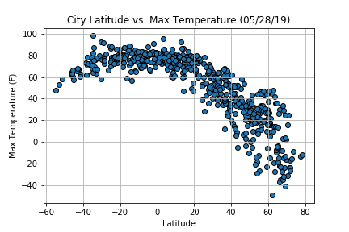
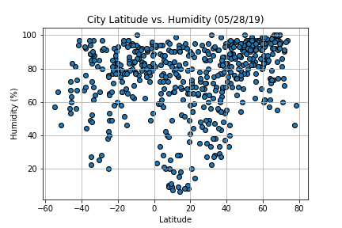
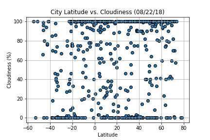
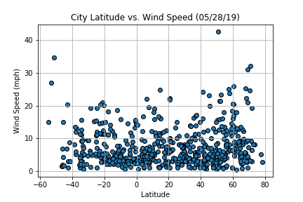

# What's the weather like?

## Part I - Weather

A Python script was developed to visualize the weather of 500+ cities across the world of varying distance from the equator. Data was pulled from [OpenWeatherMap API](https://openweathermap.org/api).

Initial scatter plots showcase the following relationships:

* ### Temperature (F) vs. Latitude

* ### Humidity (%) vs. Latitude

* ### Cloudiness (%) vs. Latitude

* ### Wind Speed (mph) vs. Latitude

