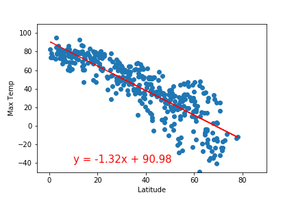
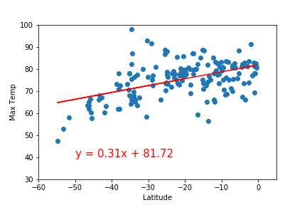
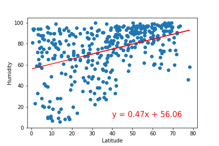
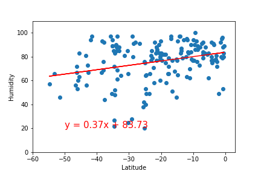
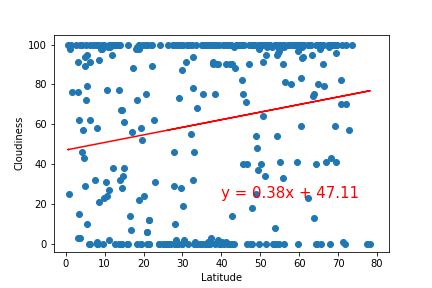
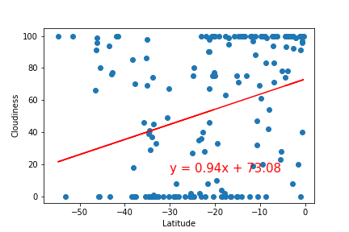
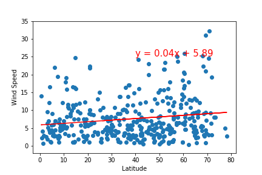
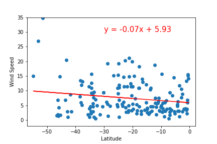

# What's the weather like?

## Part I - Weather

A Python script was developed to visualize the weather of 500+ cities across the world of varying distance from the equator. Data was pulled from [OpenWeatherMap API](https://openweathermap.org/api).

Initial scatter plots showcase the following relationships:

* ### Temperature (F) vs. Latitude

This plot shows cities with the highest maximum temperatures falling between -40 and 20 degrees of latitude and then temperatures falling as the cities lie further away from the equator. The bulk of them are in the Northern Hemisphere.

* ### Humidity (%) vs. Latitude

As indicated in the plot above, there isn't a strong correlation between humidity and city latitude.

* ### Cloudiness (%) vs. Latitude

Cloudiness is completely independent of where a city is located.

* ### Wind Speed (mph) vs. Latitude

Other than a few outliers, most cities experience wind speeds of 0 to 20 mph independant of their distance to the equator.

## Linear Regression on each relationship by hemisphere

* ### Northern Hemisphere - Temperature (F) vs. Latitude

* ### Southern Hemisphere - Temperature (F) vs. Latitude

* ### Northern Hemisphere - Humidity (%) vs. Latitude

* ### Southern Hemisphere - Humidity (%) vs. Latitude

* ### Northern Hemisphere - Cloudiness (%) vs. Latitude

* ### Southern Hemisphere - Cloudiness (%) vs. Latitude

* ### Northern Hemisphere - Wind Speed (mph) vs. Latitude

* ### Southern Hemisphere - Wind Speed (mph) vs. Latitude

